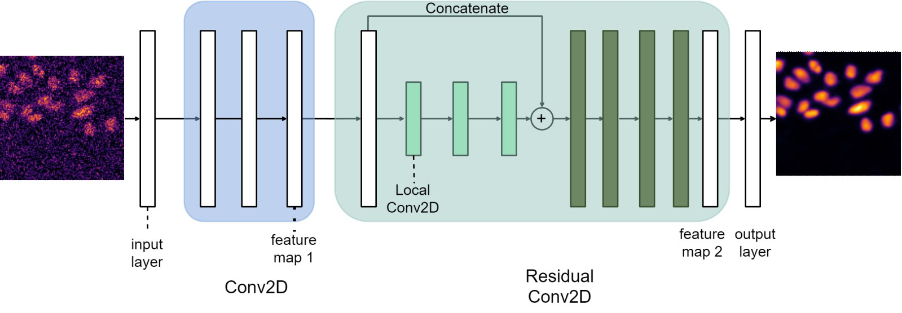
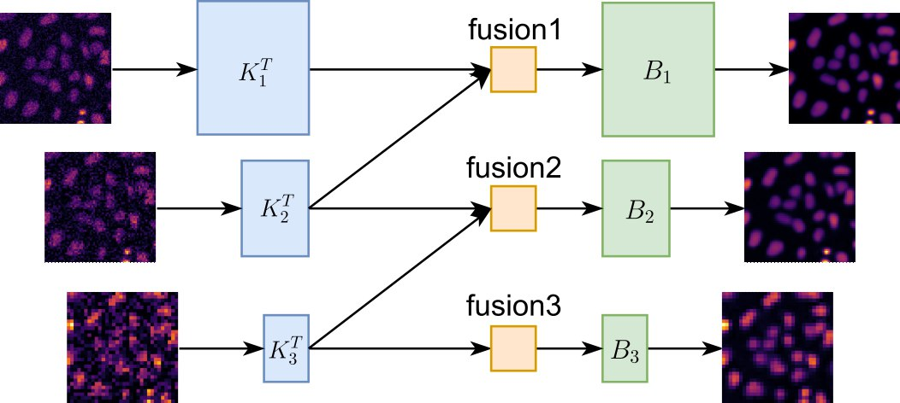
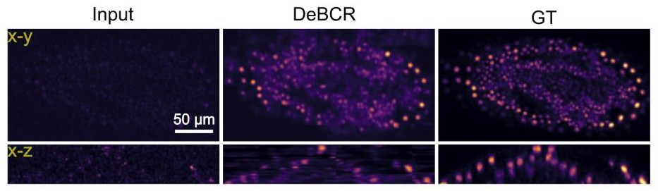

# DeBCR
### Deblurring (denoising/deconvolution) light microscopy images using a multi-resolution neural network

**DeBCR** is a compact multi-resolution deep learning model for light microscopy image restorations (deblurring: denoising and deconvolution).

This is an open-source project and is licensed under [MIT license](LICENSE).

You can use **DeBCR** as:
- python library `debcr` via interactive `Jupyter Notebook/Lab` sessions (see below)
- [napari](https://github.com/napari/napari) plugin [`napari-debcr`](https://github.com/DeBCR/napari-debcr/)

For the installation/usage questions please write to the [Issue Tracker](https://github.com/leeroyhannover/DeBCR/issues).

## Contents

- [About](#about) - key points of the network structure and results examples
- [Installation](#installation) - instructions on `debcr` installation for local usage
- [Usage](#usage) - local usage scenarious and respective tutorials 
- [Samples](#samples) - link to example data and weigths

## About

**DeBCR** is implemented based on the original Beylkin-Coifman-Rokhlin (BCR) model, implemented within DNN structure:


In contrast to the traditional single-stage residual BCR learning process, DeBCR integrates feature maps from multiple resolution levels:


The example of the **DeBCR** performance on the low/high exposure confocal data (*Tribolium castaneum* from [CARE](https://www.nature.com/articles/s41592-018-0216-7)) is shown below:


<!--
For more details on implementaion and benchmarks please see our recent preprint:
Li R., Yushkevich A., Chu X., Kudryashev M., Yakimovich A. Denoising, Deblurring, and optical Deconvolution for cryo-ET and light microscopy with a physics-informed deep neural network DeBCR. *bioRxiv*, 2024.
-->

## Installation

`debcr` has two main versions:
- [GPU version]((#gpu-installation)) (**recommended**) - more dependencies, full version (predictions+training);
- [CPU version](#cpu-installation) (*lightweight*) - easy install, limited scope (predictions only).

To install `debcr` and its CPU/GPU dependencies you would need [pip](https://pypi.org/project/pip/).

For GPU dependencies you would also need a python package environment manager, like `(micro)mamba` ([mamba.readthedocs.io](https://mamba.readthedocs.io/)) or 'conda-forge' ([conda-forge.org](https://conda-forge.org/)). We will use `micromamba` as an example.

Although not required, a package manager to create environment is also recommended for the CPU version.

To avoid dependency problems, do not install both CPU and GPU versions in the same environment.

### CPU installation

0. (optional) Create and activate package environment:
   ```bash
   micromamba env create -n debcr-cpu -c conda-forge python=3.9 pip
   micromamba activate debcr-cpu
   ```
1. Install CPU version of `debcr` package via pip by
    ```bash
    pip install debcr[tf-cpu] @ git+https://github.com/DeBCR/DeBCR
    ```

### GPU installation

To install/use GPU version you need to have a GPU (>=16GB VRAM) with `CUDA` installed.

0. Create and activate package environment:
   ```bash
   micromamba env create -n debcr-gpu -c conda-forge python=3.9 pip
   micromamba activate debcr-gpu
   ```
1. Install conda-like CUDA dependencies:
    ```bash
    micromamba install -c conda-forge cudatoolkit=11.7 cudnn=8.4
    ```
2. Install GPU version of `debcr` package via pip by
    ```bash
    pip install debcr[tf-gpu-cu117] @ git+https://github.com/DeBCR/DeBCR
    ```

### GPU check and troubleshooting

After installation we recommend to check that TensorFlow library, needed for our model, recognizes GPUs:
```bash
python
>>> import tenforflow as tf
>>> tf.config.list_physical_devices('GPU')
```
for a single GPU you should see something like:
```
[PhysicalDevice(name='/physical_device:GPU:0', device_type='GPU')]
```

If the GPU list is empty, it might be bacause `TensorFlow` cannot find `cudnn`. To fix that, please make the following export for the current bash session (or add it permanently to your `~/.bashrc`):
```bash
export LD_LIBRARY_PATH=/path/to/micromamba/envs/debcr-gpu/lib/python3.9/site-packages/nvidia/cudnn/lib/:${LD_LIBRARY_PATH}
```
with the actual location/name of your package manager and name of your environment for GPU version of `debcr` package. 

If after that the output list is still empty, please make sure that you:
* have available and visible GPU
* installed and sourced **CUDA Driver** and **CUDA Tollkit** for `CUDA-11.5/7`
* installed CUDA dependencies correctly (as described above)
* activated correct package environemnt for `debcr` 
* exported to `LD_LIBRARY_PATH` correct path to cudnn libraries from your GPU-version `debcr` environment (see instructions above)

### Jupyter for interactive API usage

Finally, to use `debcr` as a python library (API) interactively as either CPU version (for prediction only) or as a GPU version (for both traininig and prediction) you need to install a [Jupyter Notebook/Lab](https://jupyter.org/install).

For example, install Jupyter Lab to your `debcr` environment by:
```bash
pip install jupyterlab
```

## Usage

To showcase how to use `debcr` as a python library (API) interactively in `Jupyter Notebook/Lab`, we prepared several usage examples:
   | Notebook                                                          | Purpose | Requires |
   | :---------------------------------------------------------------- | :------ | :------- | 
   | [predict_api_samples.ipynb](notebooks/predict_api_samples.ipynb)  | predict on prepared data | CPU/GPU, [sample data](#samples) |
   | [predict_api_custom.ipynb](notebooks/predict_api_custom.ipynb)    | prepare raw data and predict | CPU/GPU |

You can either download them separately or you may clone the whole **DeBCR** repository locally by:
```bash
git clone https://github.com/DeBCR/DeBCR
```

To use notebooks, activate the respective `debcr` environment, e.g.:
```bash
micromamba activate debcr-gpu
```
and start jupyter session in the directory with the notebook, e.g.:
```bash
jupyter-lab
```

Some of the notebooks require:
- *sample data* - examples of pre-processed training/validation/testing data;
- *sample weights* - examples of the trained model weights, respective to *sample data*;
which are described [in the section below](#samples).

## Samples

To evaluate **DeBCR** on various image restoration tasks, several previously published datasets were assembled, pre-processed and publicly deposited as NumPy (.npz) arrays in three essential sets (train, validation and test). The corresponding weights for DeBCR model, trained on respective train subsets, are provided along with the data. 

The datasets aim at the image restoration tasks such as denoising and super-resolution deconvolution.

Access data and weights on Zenodo: [10.5281/zenodo.12626121](https://zenodo.org/doi/10.5281/zenodo.12626121).