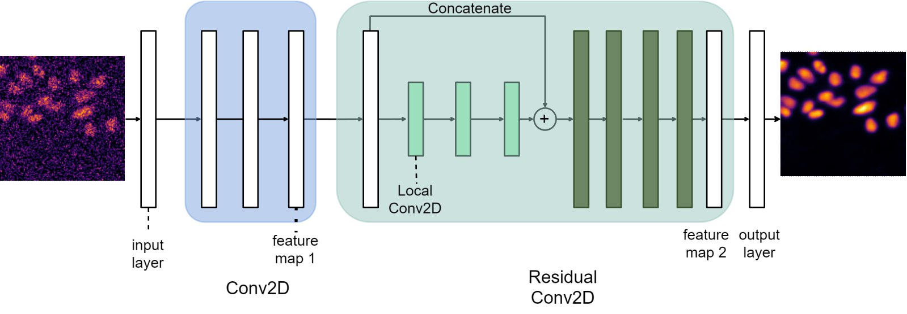
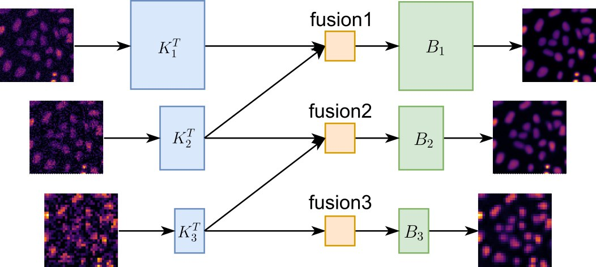
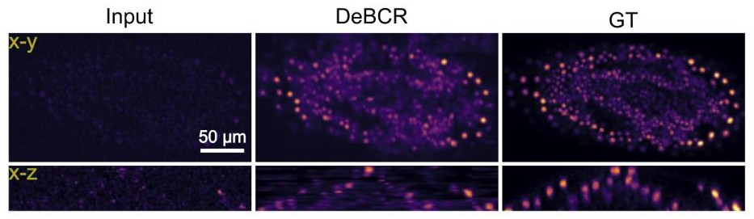

# DeBCR
### Deblurring of light microscopy images using a multi-resolution neural network

**DeBCR** is a compact multi-resolution deep learning model for light microscopy image restorations (such as denoising and deconvolution).

This is an open-source project and is licensed under [MIT license](LICENSE).

You can use **DeBCR** via:
- `Jupyter Notebook/Lab` session as a Python library `debcr` - proceed with reading this repository;
- [Napari viewer](https://github.com/napari/napari) as an add-on plugin `napari-debcr` - proceed with the [napari-debcr repository](https://github.com/DeBCR/napari-debcr/).

For any installation/usage questions please write to the [Issue Tracker](https://github.com/leeroyhannover/DeBCR/issues).

## Contents

- [Installation](#installation) - installation options, dependencies and instructions
- [Usage](#usage) - usage scenarious and respective tutorials
- [Samples](#samples) - link to the example data and respective trained model weigths
- [About](#about) - key points of the network structure and results demo

## Installation

There are two installation versions for `DeBCR`:
- a GPU version (**recommended**) -  allows full `DeBCR` functionality, including fast model training;
- a CPU version (*limited*) - suitable only if you do not plan to use training, since doing it on CPUs might be very slow.

For a GPU version you need to have access to a GPU device with:
- preferrably at least 16Gb of VRAM;
- a CUDA Toolkit version compatible to your device (recommemded: [CUDA-11.7](https://developer.nvidia.com/cuda-11-7-0-download-archive));
- a cuDNN version compatible to the CUDA above (recommemded: v8.4.0 for CUDA-11.x from [cuDNN archive](https://developer.nvidia.com/rdp/cudnn-archive)).

For GPU dependencies installation 

> **Note**
> <br/> A proper CUDA and cuDNN installation and configuration might be tricky, especially if you work on an HPC cluster. Thus, try to contact your local system administrator first, before trying to install it yourself. 

### Create a package environment (optional)

For a clean installation, we also recommend using one of Python package environment managers, for example:
- `micromamba`/`mamba` (see [mamba.readthedocs.io](https://mamba.readthedocs.io/)), used as example below
- `conda-forge` (see [conda-forge.org](https://conda-forge.org/))

We will use `micromamba` as an example package manager. Create an environment for `DeBCR` using
```bash
micromamba env create -n debcr python=3.9
```
and activate it for further installation or usage by
```bash
micromamba activate debcr
```

### Install DeBCR

Navigate to the desired directory by
```bash
cd /path/for/download
```
clone this repository on your system by
```bash
git clone https://github.com/DeBCR/DeBCR
```
and enter the local repository directory by
```bash
cd ./DeBCR
```

Next, install one of the `DeBCR` versions as

| Target hardware  | Backend         | Command  |
| :--------------- | :-------------- | :------- | 
| GPU (**recommended**) | TensorFlow-GPU-2.11 | <pre> pip install .[tf-gpu] </pre> |
| CPU (*limited*) | TensorFlow-CPU-2.11 | <pre> pip install .[tf-cpu] </pre> |

For a GPU version installation, it is recommended to check if your GPU device is recognised by TensorFlow in your `DeBCR` environment.

This GPU checking procedure as well as some further advices on how to troubleshoot GPU dependencies installation for `DeBCR` are described on the dedicated page ["GPU-troubleshoot"](docs/GPU-troubleshoot.md). 

### Install Jupyter

Finally, to use `debcr` as a python library (API) interactively as either CPU version (for prediction only) or as a GPU version (for both traininig and prediction) you need to install a [Jupyter Notebook/Lab](https://jupyter.org/install).

For example, install Jupyter Lab to your `debcr` environment by
```bash
pip install jupyterlab
```

## Usage

To showcase how to use `debcr` as a python library (API) interactively in `Jupyter Notebook/Lab`, we prepared several usage examples (available in the cloned repository at `DeBCR/notebooks`):
   | Notebook                                                          | Purpose | Hardware | Data |
   | :---------------------------------------------------------------- | :------ | :------- | :------- | 
   | [predict_api_samples.ipynb](notebooks/predict_api_samples.ipynb)  | prediction | CPU/GPU | pre-processed: NPZ |
   | [predict_api_custom.ipynb](notebooks/predict_api_custom.ipynb)    | pre-processing </br> prediction | CPU/GPU | raw: TIF(F), JP(E)G, etc. |
   | [train_api_samples.ipynb](notebooks/train_api_samples.ipynb)      | training | GPU | pre-processed: NPZ |

To use notebooks, activate the respective environment (if any) and start Jupyter session in the directory with notebook
```bash
micromamba activate debcr
jupyter-lab
```

Some of notebooks use ["samples"](#samples):
- *sample data* - examples of pre-processed training/validation/testing data;
- *sample weights* - examples of the trained model weights, respective to *sample data*.

## Samples

To evaluate **DeBCR** on various image restoration tasks, several previously published datasets were assembled, pre-processed and publicly deposited as NumPy (.npz) arrays in three essential sets (train, validation and test). The corresponding weights for DeBCR model, trained on respective train subsets, are provided along with the data.

The datasets aim at the image restoration tasks such as denoising and super-resolution deconvolution.

Access data and weights on Zenodo: [10.5281/zenodo.12626121](https://zenodo.org/doi/10.5281/zenodo.12626121).

## About

**DeBCR** approximates imaging process inversion with deep convolutional neural network (DCNN), based on compact BCR-representation ([Beylkin G. et al., *Comm. Pure Appl. Math*, 1991](https://onlinelibrary.wiley.com/doi/10.1002/cpa.3160440202)) for convolutions and its DCNN implementation as proposed in BCR-Net ([Fan Y. et al., *J. Comput. Phys.*, 2019](https://www.sciencedirect.com/science/article/pii/S0021999119300762)):


In contrast to the traditional single-stage residual BCR learning process, DeBCR integrates feature maps from multiple resolution levels:


The example of the **DeBCR** performance on the low/high exposure confocal data of *Tribolium castaneum* sample from the **CARE** work ([Weigert et al., *Nat. Methods*, 2018](https://www.nature.com/articles/s41592-018-0216-7)) is shown below:


<!--
For more details on implementaion and benchmarks please see our recent preprint:
Li R., Yushkevich A., Chu X., Kudryashev M., Yakimovich A. Denoising, Deblurring, and optical Deconvolution for cryo-ET and light microscopy with a physics-informed deep neural network DeBCR. *bioRxiv*, 2024.
-->